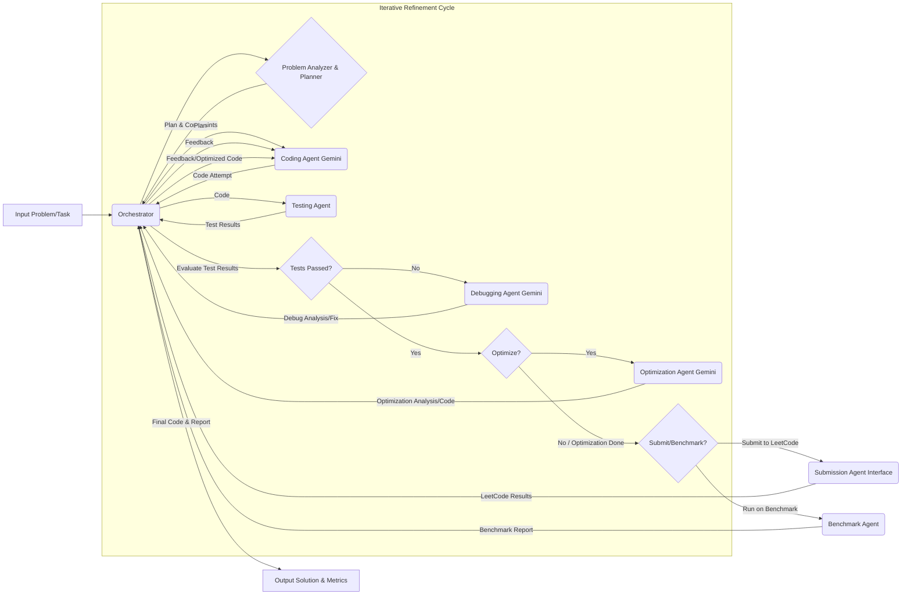

# LeetWeaver: Multi-Agent Coding System Architecture

## Core Concept
LeetWeaver employs a team of specialized AI agents, orchestrated to iteratively develop, test, debug, and optimize solutions for coding problems. It takes a LeetCode problem description as input and aims to produce a verified, efficient solution, optionally submitting it to LeetCode and running it against benchmarks.

## Architecture Diagram

## Agent Roles and Responsibilities

### Orchestrator
**Role:** The central coordinator and state manager.  
**Function:**
- Manages the overall workflow.
- Directs tasks to specialized agents.
- Passes data between them (problem description, code, test results, feedback).
- Maintains the current state (code version, plan, iteration count).
- Decides the next step based on agent outputs.
- Handles termination conditions (success, failure, max iterations).

### Problem Analyzer & Planner Agent
**Role:** Understands the problem and devises a strategy.  
**Function:**
- Parses the problem description, identifies requirements and constraints.
- Suggests suitable algorithms and data structures.
- Creates a high-level implementation plan or detailed pseudocode.

**Input:** LeetCode Problem Description.  
**Output:** Structured Problem Analysis, Constraints List, Algorithm/Data Structure Choices, Implementation Plan/Pseudocode.

### Coding Agent (Powered by Gemini)
**Role:** Writes the code based on the plan.  
**Function:**
- Generates code in the target language (e.g., Python3).
- Incorporates feedback from the Debugger or Optimizer in subsequent iterations.

**Input:** Implementation Plan, Constraints, Debugging Feedback, Optimization Suggestions, Previous Code (if applicable).  
**Output:** Code Implementation.

### Testing Agent
**Role:** Verifies the code's correctness.  
**Function:**
- Extracts example test cases from the problem.
- Executes the code against the test suite and reports detailed results.

**Input:** Code Implementation, Problem Description (for examples/constraints).  
**Output:** Comprehensive Test Results Report.

### Debugging Agent (Powered by Gemini)
**Role:** Identifies and suggests fixes for bugs.  
**Function:**
- Analyzes failing test cases/error messages.
- Pinpoints root causes and provides actionable fixes.

**Input:** Code Implementation, Failing Test Results Report.  
**Output:** Bug Analysis, Code Correction Suggestions / Patched Code.

### Optimization Agent (Powered by Gemini)
**Role:** Improves the performance of correct code.  
**Function:**
- Analyzes working code for time and space complexity.
- Suggests improvements (e.g., algorithmic changes, better data structures).
- Provides optimized code directly.

**Input:** Working Code Implementation, Problem Constraints.  
**Output:** Performance Analysis, Optimization Recommendations / Optimized Code.

### Submission Agent (Interface)
**Role:** Interacts with the LeetCode platform via an automation script.  
**Function:**
- Takes the final, verified code and submits it.
- Parses submission outcomes and performance metrics.

**Input:** Final Code Implementation.  
**Output:** LeetCode Submission Status, Runtime, Memory Usage.

### Benchmark Agent
**Role:** Evaluates the code against standard coding benchmarks.  
**Function:** Takes the final code. Runs it against specified benchmark suites such as HumanEval, MBPP, APPS, BigCodeBench, and CodeContests. Collects and reports relevant metrics (e.g., pass@k, execution success rate) for each benchmark.

**Input:** Final Code Implementation, Benchmark Specification.  
**Output:** Benchmark Performance Report.

## Iterative Flow
The core of LeetWeaver is the loop managed by the Orchestrator: **Plan -> Code -> Test**.

- **If Test Fails:** → Debug → Code → Test...
- **If Test Passes:** → (Optional) Optimize → Code → Test...
- **If Tests Pass & Optimization OK/Skipped:** → Submit/Benchmark → Finish.

The Orchestrator uses the results from each agent to decide the next action, ensuring the process iterates towards a correct and efficient solution.

## Integration Notes
The **Submission Agent** specifically needs to be designed to call the Python script from the Solver.py code. You'll need to adapt that script to make it runnable programmatically (e.g., via a function call or CLI) and ensure it returns structured results.

The **Coding, Debugging, and Optimization agents** will leverage the Gemini API directly, with prompts tailored by the Orchestrator for their specific tasks.

This **LeetWeaver** architecture provides a robust framework for your project, emphasizing iteration and specialization to tackle complex coding challenges.